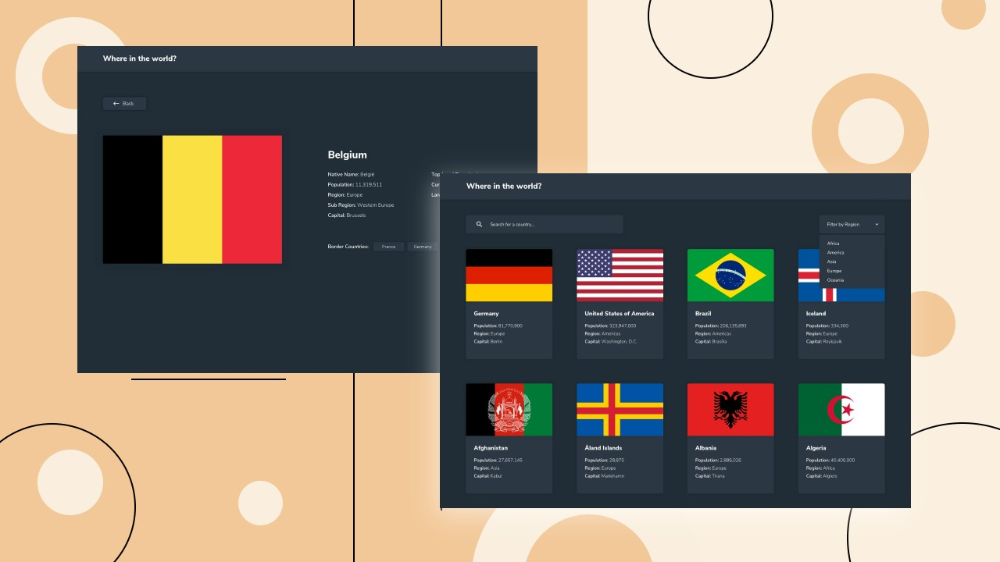

## Merhaba! 👋

Bu front-end kodlama mücadelesine göz attığınız için teşekkür ederiz.

zorluklar, gerçekçi projeler oluşturarak kodlama becerilerinizi geliştirmenize yardımcı olur.

**Bu meydan okumayı yapmak için iyi bir JavaScript bilgisine ihtiyacınız var.**

## Meydan okuma

Göreviniz, ülke verilerini çekmek ve tasarımlarda olduğu gibi görüntülemek için [REST Countries API](https://restcountries.com/) ile entegre olmaktır.

Kullanıcılarınız şunları yapabilmelidir:

- Ana sayfada API'den tüm ülkeleri görün
- Bir `input` alanını kullanarak bir ülke arayın
- Ülkeleri bölgeye göre filtreleyin
- Ayrı bir sayfada daha ayrıntılı bilgi görmek için bir ülkeye tıklayın
- Ayrıntı sayfasındaki sınır ülkelerine tıklayın

## Her şeyi nerede bulabilirim

Göreviniz, projeyi `/design` klasörü içindeki tasarımlara uygun şekilde yapmaktır.

Bu yarışmada, her iki sayfa için de mobil ve masaüstü tasarımları bulacaksınız.

Tasarımlar JPG statik formatındadır. JPG'leri kullanmak, `font-size`, `padding` ve `margin` gibi stiller için en benzer şekilde kendiniz karar vermeniz gerektiği anlamına gelir. Bunlarda mükemmellik beklemiyoruz.

Ülke bayrakları [REST Countries API](https://restcountries.com/) çekileceğinden ve simgeler için bir simge yazı tipi kitaplığı kullanabileceğiniz için bu zorluk için herhangi bir varlık yoktur.

Renk paleti ve yazı tipleri gibi ihtiyacınız olan bilgileri içeren bir `style-guide.md` dosyası da vardır.

## Projenizi oluşturma

Kendinizi rahat hissettiğiniz herhangi bir iş akışını kullanmaktan çekinmeyin. Aşağıda önerilen bir süreç bulunmaktadır, ancak bu adımları izlemek zorunda değilsiniz:

1. Projenizi [GitHub](https://github.com/) üzerinde herkese açık bir havuz olarak başlatın. Bir repo oluşturmak, kodunuzu paylaşmayı kolaylaştıracaktır. Bunu nasıl yapacağınızdan emin değilseniz [bu Git Hub kaynağını okuyun](https://try.github.io/).
2. Kodunuzu bir web adresine yayınlayın. Bu, projenizin URL'sini paylaşmanız da faydalı olacaktır.
3. Projeyi nasıl ele alacağınızı planlamaya başlamak için tasarımları gözden geçirin. Bu adım, CSS sınıflarının yeniden kullanılabilir stiller oluşturması için ileriyi düşünmenize yardımcı olması açısından çok önemlidir.
4. Bunu yaparken bir metodolojiye bağlı kalmayı unutmayın, `OOCSS` veya `BEM` vb.
5. Herhangi bir stil eklemeden önce içeriğinizi HTML ile yapılandırın. Önce HTML'nizi yazmak, dikkatinizi iyi yapılandırılmış içerik oluşturmaya odaklamanıza yardımcı olabilir.
6. Herhangi bir framework kullanmanızı önermiyoruz, ancak isterseniz veya gerekli görürseniz kullanmakta özgürsünüz.
7. Gulp veya derleyici kullanıyorsanız derlenmemiş halini bizimle paylaşmayı unutmayın.

## Çözümünüzü paylaşma

**#bitmiş projeler** çözüm sayfanızı [insan kaynakları](mailto:contact.hr@nexum.com.tr) ile zip, url veya git bağlantısında paylaşın.

**İyi eğlenceler kolay gelsin!** 🚀
